来源 <http://hukai.me/android-performance-memory/> 

Google近期在Udacity上发布了[Android性能优化的在线课程](https://www.udacity.com/course/ud825)，分别从渲染，运算与内存，电量几个方面介绍了如何去优化性能，这些课程是Google之前在Youtube上发布的[Android性能优化典范](http://hukai.me/android-performance-patterns/)专题课程的细化与补充。

下面是内存篇章的学习笔记，部分内容与前面的性能优化典范有重合，欢迎大家一起学习交流！

### 1)Memory, GC, and Performance

众所周知，与C/C++需要通过手动编码来申请以及释放内存有所不同，Java拥有GC的机制。Android系统里面有一个**Generational Heap Memory**的 模型，系统会根据内存中不同的内存数据类型分别执行不同的GC操作。例如，最近刚分配的对象会放在Young Generation区域，这个区域的对象通常都是会快速被创建并且很快被销毁回收的，同时这个区域的GC操作速度也是比Old Generation区域的GC操作速度更快的。

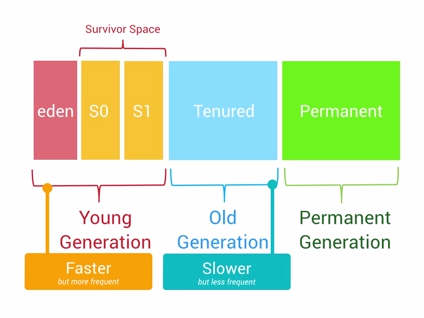

除了速度差异之外，执行GC操作的时候，所有线程的任何操作都会需要暂停，等待GC操作完成之后，其他操作才能够继续运行。

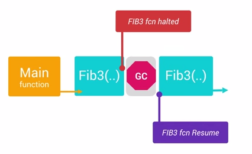

通常来说，单个的GC并不会占用太多时间，但是大量不停的GC操作则会显著占用帧间隔时间(16ms)。如果在帧间隔时间里面做了过多的GC操作，那么自然其他类似计算，渲染等操作的可用时间就变得少了。

### 2)Memory Monitor Walkthrough
<!--more-->
Android Studio中的Memory Monitor可以很好的帮助我们查看程序的内存使用情况。

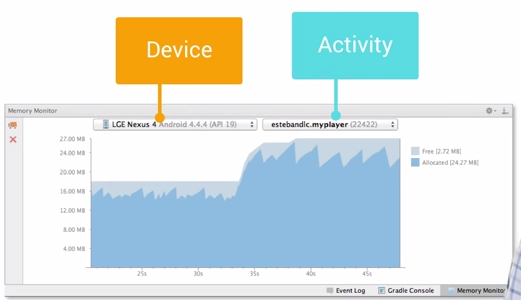

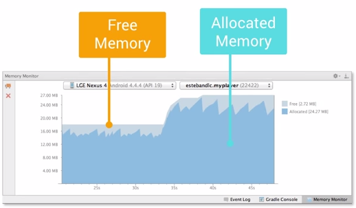

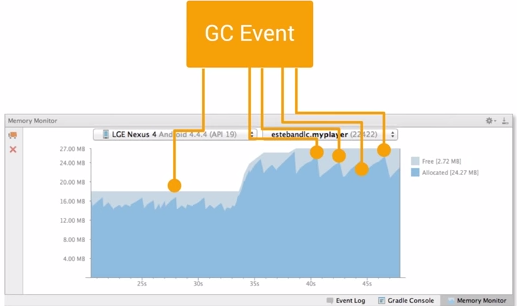

### 3)Memory Leaks

内存泄漏表示的是不再用到的对象因为被错误引用而无法进行回收。

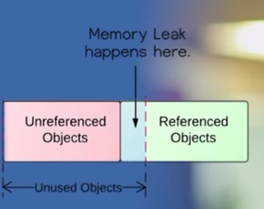

发生内存泄漏会导致Memory Generation中的剩余可用Heap Size越来越小，这样会导致频繁触发GC，更进一步引起性能问题。

举例内存泄漏，下面`init()`方法来自某个自定义View：

`private void init() {`

`ListenerCollector collector = ``new` `ListenerCollector();`

`collector.setListener(``this``, mListener);`

`}`

上面的例子容易存在内存泄漏，如果activity因为设备翻转而重新创建，自定义的View会自动重新把新创建出来的mListener给绑定到ListenerCollector中，但是当activity被销毁的时候，mListener却无法被回收了。

### 4)Heap Viewer Walkthrough

下图演示了Android Tools里面的Heap Viewer的功能，我们可以看到当前进程中的Heap Size的情况，分别有哪些类型的数据，占比是多少。

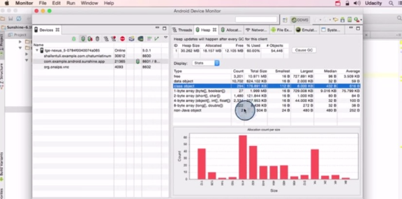

### 5)Understanding Memory Churn

**Memory Churn内存抖动**，内存抖动是因为在短时间内大量的对象被创建又马上被释放。瞬间产生大量的对 象会严重占用Young Generation的内存区域，当达到阀值，剩余空间不够的时候，会触发GC从而导致刚产生的对象又很快被回收。即使每次分配的对象占用了很少的内存， 但是他们叠加在一起会增加Heap的压力，从而触发更多其他类型的GC。这个操作有可能会影响到帧率，并使得用户感知到性能问题。

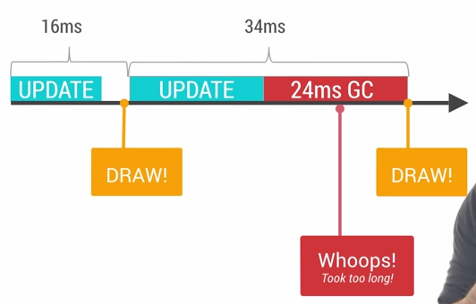

解决上面的问题有简洁直观方法，如果你在**Memory Monitor**里面查看到短时间发生了多次内存的涨跌，这意味着很有可能发生了内存抖动。

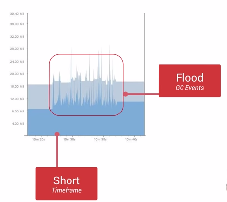

同时我们还可以通过**Allocation Tracker**来查看在短时间内，同一个栈中不断进出的相同对象。这是内存抖动的典型信号之一。

当你大致定位问题之后，接下去的问题修复也就显得相对直接简单了。例如，你需要避免在for循环里面分配对象占用内存，需要尝试把对象的创建移到循 环体之外，自定义View中的onDraw方法也需要引起注意，每次屏幕发生绘制以及动画执行过程中，onDraw方法都会被调用到，避免在onDraw 方法里面执行复杂的操作，避免创建对象。对于那些无法避免需要创建对象的情况，我们可以考虑对象池模型，通过对象池来解决频繁创建与销毁的问题，但是这里 需要注意结束使用之后，需要手动释放对象池中的对象。

### 6)Allocation Tracker

关于Allocation Tracker工具的使用，不展开了，参考下面的链接：

### 7)Improve Your Code To Reduce Churn

下面演示一个例子，如何通过修改代码来避免内存抖动。优化之前的内存检测图：

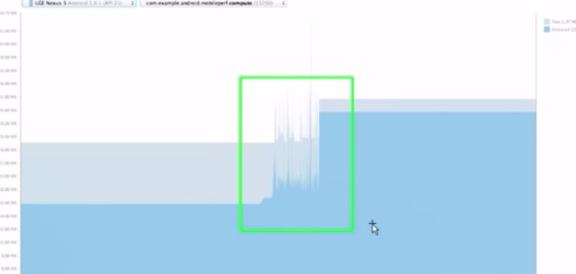

定位代码之后，修复了String拼接的问题：

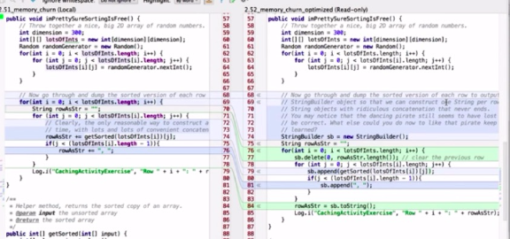

优化之后的内存监测图：

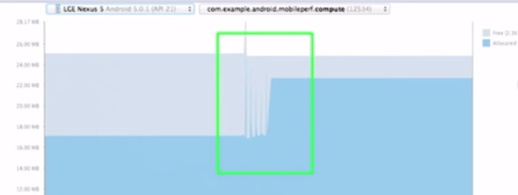

### 8)Recap

上面提到了三种测量内存的工具，下面再简要概括一下他们各自的特点：

* **Memory Monitor：**跟踪整个app的内存变化情况。
* **Heap Viewer：**查看当前内存快照，便于对比分析哪些对象有可能发生了泄漏。
* **Allocation Tracker：**追踪内存对象的来源。

**Notes:**关于更多内存优化，这里还有一篇文章，请点击[这里](http://hukai.me/android-training-managing_your_app_memory/)