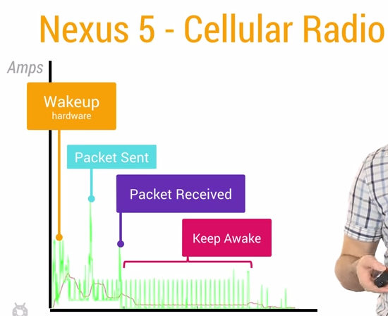
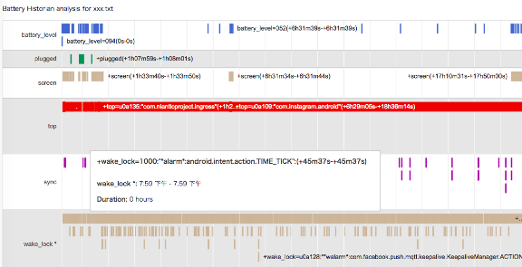
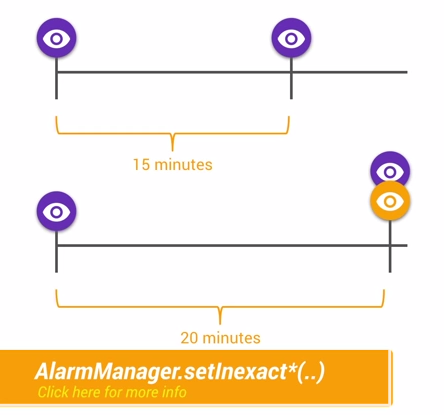
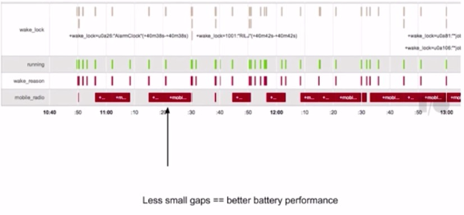
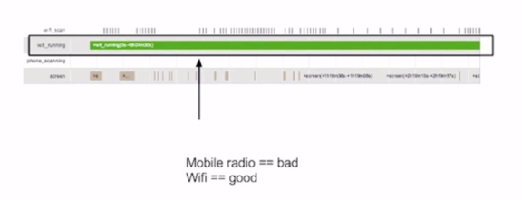

发表于 2015-04-20 00:52 632 

来源 <http://hukai.me/android-performance-battery/> 

Google近期在Udacity上发布了[Android性能优化的在线课程](https://www.udacity.com/course/ud825)，分别从渲染，运算与内存，电量几个方面介绍了如何去优化性能，这些课程是Google之前在Youtube上发布的[Android性能优化典范](http://hukai.me/android-performance-patterns/)专题课程的细化与补充。

下面是电量篇章的学习笔记，部分内容与前面的性能优化典范有重合，欢迎大家一起学习交流！

### 1)Understanding Battery Drain

手机各个硬件模块的耗电量是不一样的，有些模块非常耗电，而有些模块则相对显得耗电量小很多。

电量消耗的计算与统计是一件麻烦而且矛盾的事情，记录电量消耗本身也是一个费电量的事情。唯一可行的方案是使用第三方监测电量的设备，这样才能够获取到真实的电量消耗。

当设备处于待机状态时消耗的电量是极少的，以N5为例，打开飞行模式，可以待机接近1个月。可是点亮屏幕，硬件各个模块就需要开始工作，这会需要消耗很多电量。

使用WakeLock或者JobScheduler唤醒设备处理定时的任务之后，一定要及时让设备回到初始状态。每次唤醒蜂窝信号进行数据传递，都会消耗很多电量，它比WiFi等操作更加的耗电。

### 2)Battery Historian
<!--more-->
[Battery Historian](https://developer.android.com/about/versions/android-5.0.html#Power)是Android 5.0开始引入的新API。通过下面的指令，可以得到设备上的电量消耗信息：

`$ adb shell dumpsys batterystats > xxx.txt  ``//得到整个设备的电量消耗信息`

`$ adb shell dumpsys batterystats > com.package.name > xxx.txt ``//得到指定app相关的电量消耗信息`

得到了原始的电量消耗数据之后，我们需要通过Google编写的一个[python脚本](https://github.com/google/battery-historian)把数据信息转换成可读性更好的html文件：

`$ python historian.py xxx.txt > xxx.html`

打开这个转换过后的html文件，可以看到类似TraceView生成的列表数据，这里的数据信息量很大，这里就不展开了。

### 3)Track Battery Status & Battery Manager

我们可以通过下面的代码来获取手机的当前充电状态：

`// It is very easy to subscribe to changes to the battery state, but you can get the current`

`// state by simply passing null in as your receiver.  Nifty, isn't that?`

`IntentFilter filter = ``new` `IntentFilter(Intent.ACTION_BATTERY_CHANGED);`

`Intent batteryStatus = ``this``.registerReceiver(``null``, filter);`

`int chargePlug = batteryStatus.getIntExtra(BatteryManager.EXTRA_PLUGGED, -1);`

`boolean acCharge = (chargePlug == BatteryManager.BATTERY_PLUGGED_AC);`

`if` `(acCharge) {`

`Log.v(LOG_TAG,“The phone is charging!”);`

`}`

在上面的例子演示了如何立即获取到手机的充电状态，得到充电状态信息之后，我们可以有针对性的对部分代码做优化。比如我们可以判断只有当前手机为AC充电状态时 才去执行一些非常耗电的操作。

`/**`

`* This method checks for power by comparing the current battery state against all possible`

`* plugged in states. In this case, a device may be considered plugged in either by USB, AC, or`

`* wireless charge. (Wireless charge was introduced in API Level 17.)`

`*/`

`private boolean checkForPower() {`

`// It is very easy to subscribe to changes to the battery state, but you can get the current`

`// state by simply passing null in as your receiver.  Nifty, isn't that?`

`IntentFilter filter = ``new` `IntentFilter(Intent.ACTION_BATTERY_CHANGED);`

`Intent batteryStatus = ``this``.registerReceiver(``null``, filter);`

`// There are currently three ways a device can be plugged in. We should check them all.`

`int chargePlug = batteryStatus.getIntExtra(BatteryManager.EXTRA_PLUGGED, -1);`

`boolean usbCharge = (chargePlug == BatteryManager.BATTERY_PLUGGED_USB);`

`boolean acCharge = (chargePlug == BatteryManager.BATTERY_PLUGGED_AC);`

`boolean wirelessCharge = ``false``;`

`if` `(Build.VERSION.SDK_INT >= Build.VERSION_CODES.JELLY_BEAN_MR1) {`

`wirelessCharge = (chargePlug == BatteryManager.BATTERY_PLUGGED_WIRELESS);`

`}`

`return` `(usbCharge || acCharge || wirelessCharge);`

`}`

### 4)Wakelock and Battery Drain

高效的保留更多的电量与不断促使用户使用你的App会消耗电量，这是矛盾的选择题。不过我们可以使用一些更好的办法来平衡两者。

假设你的手机里面装了大量的社交类应用，即使手机处于待机状态，也会经常被这些应用唤醒用来检查同步新的数据信息。Android会不断关闭各种硬 件来延长手机的待机时间，首先屏幕会逐渐变暗直至关闭，然后CPU进入睡眠，这一切操作都是为了节约宝贵的电量资源。但是即使在这种睡眠状态下，大多数应 用还是会尝试进行工作，他们将不断的唤醒手机。一个最简单的唤醒手机的方法是使用PowerManager.WakeLock的API来保持CPU工作并 防止屏幕变暗关闭。这使得手机可以被唤醒，执行工作，然后回到睡眠状态。知道如何获取WakeLock是简单的，可是及时释放WakeLock也是非常重 要的，不恰当的使用WakeLock会导致严重错误。例如网络请求的数据返回时间不确定，导致本来只需要10s的事情一直等待了1个小时，这样会使得电量 白白浪费了。这也是为何使用带超时参数的wakelock.acquice()方法是很关键的。

但是仅仅设置超时并不足够解决问题，例如设置多长的超时比较合适？什么时候进行重试等等？解决上面的问题，正确的方式可能是使用非精准定时器。通常 情况下，我们会设定一个时间进行某个操作，但是动态修改这个时间也许会更好。例如，如果有另外一个程序需要比你设定的时间晚5分钟唤醒，最好能够等到那个 时候，两个任务捆绑一起同时进行，这就是非精确定时器的核心工作原理。我们可以定制计划的任务，可是系统如果检测到一个更好的时间，它可以推迟你的任务， 以节省电量消耗。

这正是JobScheduler API所做的事情。它会根据当前的情况与任务，组合出理想的唤醒时间，例如等到正在充电或者连接到WiFi的时候，或者集中任务一起执行。我们可以通过这个API实现很多免费的调度算法。

### 5)Network and Battery Drain

下面内容来自官方Training文档中[高效下载](http://hukai.me/android-training-course-in-chinese/connectivity/efficient-downloads/efficient-network-access.html)章节关于手机(Radio)蜂窝信号对电量消耗的介绍。

通常情况下，使用3G移动网络传输数据，电量的消耗有三种状态：

* **Full power**: 能量最高的状态，移动网络连接被激活，允许设备以最大的传输速率进行操作。
* **Low power**: 一种中间状态，对电量的消耗差不多是Full power状态下的50%。
* **Standby**: 最低的状态，没有数据连接需要传输，电量消耗最少。

下图是一个典型的3G Radio State Machine的图示(来自AT&T，详情请点击[这里](http://www.research.att.com/articles/featured_stories/2011_03/201102_Energy_efficient?fbid=SYuI20FzBum)):

**总之，为了减少电量的消耗，在蜂窝移动网络下，最好做到批量执行网络请求，尽量避免频繁的间隔网络请求。**

通过前面学习到的Battery Historian我们可以得到设备的电量消耗数据，如果数据中的移动蜂窝网络(Mobile Radio)电量消耗呈现下面的情况，间隔很小，又频繁断断续续的出现，说明电量消耗性能很不好：

经过优化之后，如果呈现下面的图示，说明电量消耗的性能是良好的：

另外WiFi连接下，网络传输的电量消耗要比移动网络少很多，应该尽量减少移动网络下的数据传输，多在WiFi环境下传输数据。

那么如何才能够把任务缓存起来，做到批量化执行呢？下面就轮到Job Scheduler出场了。

### 6)Using Job Scheduler

使用[Job Scheduler](https://developer.android.com/reference/android/app/job/JobScheduler.html)，应用需要做的事情就是判断哪些任务是不紧急的，可以交给Job Scheduler来处理，Job Scheduler集中处理收到的任务，选择合适的时间，合适的网络，再一起进行执行。

下面是使用Job Scheduler的一段简要示例，需要先有一个JobService：

`public class MyJobService extends JobService {`

`private static final String LOG_TAG = ``"MyJobService"``;`

`@Override`

`public void onCreate() {`

`super``.onCreate();`

`Log.i(LOG_TAG, ``"MyJobService created"``);`

`}`

`@Override`

`public void onDestroy() {`

`super``.onDestroy();`

`Log.i(LOG_TAG, ``"MyJobService destroyed"``);`

`}`

`@Override`

`public boolean onStartJob(JobParameters params) {`

`// This is where you would implement all of the logic for your job. Note that this runs`

`// on the main thread, so you will want to use a separate thread for asynchronous work`

`// (as we demonstrate below to establish a network connection).`

`// If you use a separate thread, return true to indicate that you need a "reschedule" to`

`// return to the job at some point in the future to finish processing the work. Otherwise,`

`// return false when finished.`

`Log.i(LOG_TAG, ``"Totally and completely working on job "` `+ params.getJobId());`

`// First, check the network, and then attempt to connect.`

`if` `(isNetworkConnected()) {`

`new` `SimpleDownloadTask() .execute(params);`

`return` `true``;`

`} ``else` `{`

`Log.i(LOG_TAG, ``"No connection on job "` `+ params.getJobId() + ``"; sad face"``);`

`}`

`return` `false``;`

`}`

`@Override`

`public boolean onStopJob(JobParameters params) {`

`// Called if the job must be stopped before jobFinished() has been called. This may`

`// happen if the requirements are no longer being met, such as the user no longer`

`// connecting to WiFi, or the device no longer being idle. Use this callback to resolve`

`// anything that may cause your application to misbehave from the job being halted.`

`// Return true if the job should be rescheduled based on the retry criteria specified`

`// when the job was created or return false to drop the job. Regardless of the value`

`// returned, your job must stop executing.`

`Log.i(LOG_TAG, ``"Whelp, something changed, so I'm calling it on job "` `+ params.getJobId());`

`return` `false``;`

`}`

`/**`

`* Determines if the device is currently online.`

`*/`

`private boolean isNetworkConnected() {`

`ConnectivityManager connectivityManager =`

`(ConnectivityManager) getSystemService(Context.CONNECTIVITY_SERVICE);`

`NetworkInfo networkInfo = connectivityManager.getActiveNetworkInfo();`

`return` `(networkInfo != ``null` `&& networkInfo.isConnected());`

`}`

`/**`

`*  Uses AsyncTask to create a task away from the main UI thread. This task creates a`

`*  HTTPUrlConnection, and then downloads the contents of the webpage as an InputStream.`

`*  The InputStream is then converted to a String, which is logged by the`

`*  onPostExecute() method.`

`*/`

`private class SimpleDownloadTask extends AsyncTask<JobParameters, Void, String> {`

`protected JobParameters mJobParam;`

`@Override`

`protected String doInBackground(JobParameters... params) {`

`// cache system provided job requirements`

`mJobParam = params[0];`

`try` `{`

`InputStream is = ``null``;`

`// Only display the first 50 characters of the retrieved web page content.`

`int len = 50;`

`URL url = ``new` `URL(``"[https://www.google.com](https://www.google.com/)"``);`

`HttpURLConnection conn = (HttpURLConnection) url.openConnection();`

`conn.setReadTimeout(10000); ``//10sec`

`conn.setConnectTimeout(15000); ``//15sec`

`conn.setRequestMethod(``"GET"``);`

`//Starts the query`

`conn.connect();`

`int response = conn.getResponseCode();`

`Log.d(LOG_TAG, ``"The response is: "` `+ response);`

`is = conn.getInputStream();`

`// Convert the input stream to a string`

`Reader reader = ``null``;`

`reader = ``new` `InputStreamReader(is, ``"UTF-8"``);`

`char[] buffer = ``new` `char[len];`

`reader.read(buffer);`

`return` `new` `String(buffer);`

`} ``catch` `(IOException e) {`

`return` `"Unable to retrieve web page."``;`

`}`

`}`

`@Override`

`protected void onPostExecute(String result) {`

`jobFinished(mJobParam, ``false``);`

`Log.i(LOG_TAG, result);`

`}`

`}`

`}`

然后模拟通过点击Button触发N个任务，交给JobService来处理

`public class FreeTheWakelockActivity extends ActionBarActivity {`

`public static final String LOG_TAG = ``"FreeTheWakelockActivity"``;`

`TextView mWakeLockMsg;`

`ComponentName mServiceComponent;`

`@Override`

`protected void onCreate(Bundle savedInstanceState) {`

`super``.onCreate(savedInstanceState);`

`setContentView(R.layout.activity_wakelock);`

`mWakeLockMsg = (TextView) findViewById(R.id.wakelock_txt);`

`mServiceComponent = ``new` `ComponentName(``this``, MyJobService.class);`

`Intent startServiceIntent = ``new` `Intent(``this``, MyJobService.class);`

`startService(startServiceIntent);`

`Button theButtonThatWakelocks = (Button) findViewById(R.id.wakelock_poll);`

`theButtonThatWakelocks.setText(R.string.poll_server_button);`

`theButtonThatWakelocks.setOnClickListener(``new` `View.OnClickListener() {`

`@Override`

`public void onClick(View v) {`

`pollServer();`

`}`

`});`

`}`

`/**`

`* This method polls the server via the JobScheduler API. By scheduling the job with this API,`

`* your app can be confident it will execute, but without the need for a wake lock. Rather, the`

`* API will take your network jobs and execute them in batch to best take advantage of the`

`* initial network connection cost.`

`*`

`* The JobScheduler API works through a background service. In this sample, we have`

`* a simple service in MyJobService to get you started. The job is scheduled here in`

`* the activity, but the job itself is executed in MyJobService in the startJob() method. For`

`* example, to poll your server, you would create the network connection, send your GET`

`* request, and then process the response all in MyJobService. This allows the JobScheduler API`

`* to invoke your logic without needed to restart your activity.`

`*`

`* For brevity in the sample, we are scheduling the same job several times in quick succession,`

`* but again, try to consider similar tasks occurring over time in your application that can`

`* afford to wait and may benefit from batching.`

`*/`

`public void pollServer() {`

`JobScheduler scheduler = (JobScheduler) getSystemService(Context.JOB_SCHEDULER_SERVICE);`

`for` `(int i=0; i<10; i++) {`

`JobInfo jobInfo = ``new` `JobInfo.Builder(i, mServiceComponent)`

`.setMinimumLatency(5000) ``// 5 seconds`

`.setOverrideDeadline(60000) ``// 60 seconds (for brevity in the sample)`

`.setRequiredNetworkType(JobInfo.NETWORK_TYPE_ANY) ``// WiFi or data connections`

`.build();`

`mWakeLockMsg.append(``"Scheduling job "` `+ i + ``"!\n"``);`

`scheduler.schedule(jobInfo);`

`}`

`}`

`}`

**Notes:**关于更多电量优化，还有一篇文章，请点击[这里](http://developer.android.com/training/efficient-downloads/index.html)